

<a href="https://github.com/heysena8-netizen"><picture><source media="(prefers-color-scheme: dark)" srcset="assets/lang-tr-off-dark.svg"></picture></a>
<picture><source media="(prefers-color-scheme: dark)" srcset="assets/lang-en-on-dark.svg"></picture>

<picture><source media="(prefers-color-scheme: dark)" srcset="assets/header-en-dark.svg"></picture>

<a href="https://www.linkedin.com/in/sena-y%C3%B6ndemli-45a1653a7/"><picture><source media="(prefers-color-scheme: dark)" srcset="assets/btn-linkedin-en-dark.svg"></picture></a>&nbsp;
<a href="mailto:sena.yondemli@basedata.com.tr"><picture><source media="(prefers-color-scheme: dark)" srcset="assets/btn-mail-en-dark.svg"></picture></a>&nbsp;
<picture><source media="(prefers-color-scheme: dark)" srcset="assets/btn-purr2play-en-dark.svg"></picture>

 

<picture><source media="(prefers-color-scheme: dark)" srcset="assets/section-01-en-dark.svg"></picture>

At <b>Basedata</b>, I build <b>Portaliva</b> end to end — a platform that digitalizes audit work for certified public accountants. I enjoy turning complex regulations and scattered data into <b>screens that make sense at a glance</b>. Alongside software, I make games under my own brand, <b>purr2play</b>.

<ul>
<li>I turn tax returns, e-invoices and e-ledgers into <b>audit-ready data</b></li>
<li>My priority: interfaces that never tire the user and information that is clear <b>at first glance</b></li>
<li>I care deeply about security, authorization and traceability</li>
<li>I build <b>local AI</b> solutions that keep sensitive data in-house</li>
<li>I develop PC games under my brand <b>purr2play</b></li>
<li>Turkish · English</li>
</ul>

 

<picture><source media="(prefers-color-scheme: dark)" srcset="assets/section-02-en-dark.svg"></picture>

<b>LANGUAGES &amp; FRONTEND</b>  
<picture><source media="(prefers-color-scheme: dark)" srcset="https://skillicons.dev/icons?i=py%2Cjs%2Chtml%2Ccss%2Cbash%2Cpowershell%2Creact%2Cmaterialui%2Cstyledcomponents%2Cnodejs%2Cnpm&perline=12&theme=dark"></picture>

<b>BACKEND &amp; DATA</b>  
<picture><source media="(prefers-color-scheme: dark)" srcset="https://skillicons.dev/icons?i=django%2Cfastapi%2Cflask%2Cpostgres%2Credis%2Crabbitmq%2Cpytorch%2Copencv%2Cselenium%2Cjest&perline=12&theme=dark"></picture>

<b>DEVOPS &amp; INFRASTRUCTURE</b>  
<picture><source media="(prefers-color-scheme: dark)" srcset="https://skillicons.dev/icons?i=docker%2Ckubernetes%2Cansible%2Cnginx%2Cgrafana%2Clinux%2Cgit%2Cvscode&perline=12&theme=dark"></picture>

<picture><source media="(prefers-color-scheme: dark)" srcset="assets/ecosystem-en-dark.svg">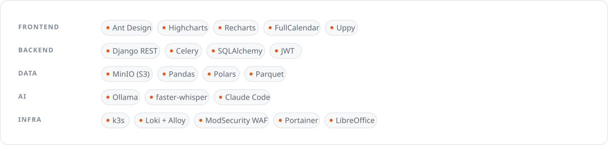</picture>

 

<picture><source media="(prefers-color-scheme: dark)" srcset="assets/section-03-en-dark.svg"></picture>

<picture><source media="(prefers-color-scheme: dark)" srcset="assets/card-01-en-dark.svg">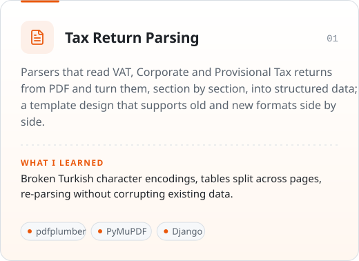</picture>
<picture><source media="(prefers-color-scheme: dark)" srcset="assets/card-02-en-dark.svg">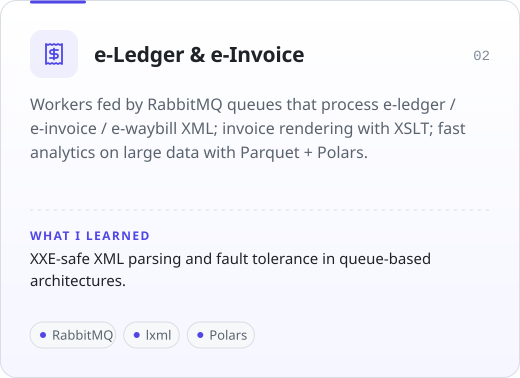</picture>

<picture><source media="(prefers-color-scheme: dark)" srcset="assets/card-03-en-dark.svg">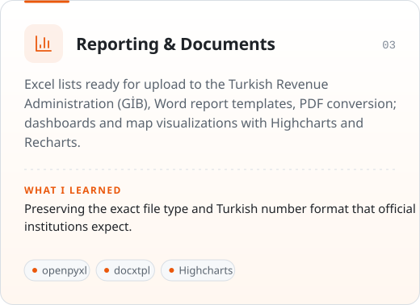</picture>
<picture><source media="(prefers-color-scheme: dark)" srcset="assets/card-04-en-dark.svg">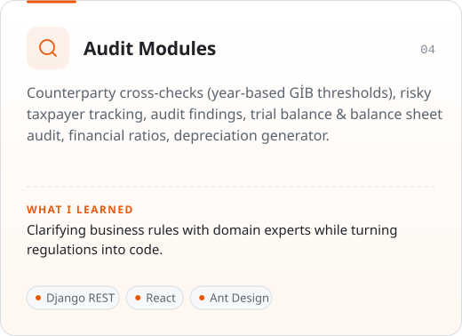</picture>

<picture><source media="(prefers-color-scheme: dark)" srcset="assets/card-05-en-dark.svg">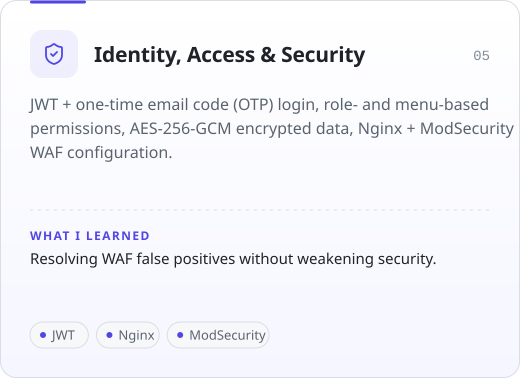</picture>
<picture><source media="(prefers-color-scheme: dark)" srcset="assets/card-06-en-dark.svg">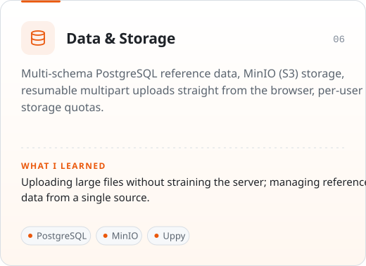</picture>

<picture><source media="(prefers-color-scheme: dark)" srcset="assets/card-07-en-dark.svg">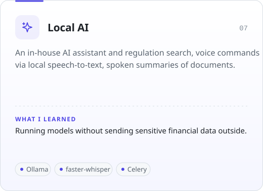</picture>
<picture><source media="(prefers-color-scheme: dark)" srcset="assets/card-08-en-dark.svg">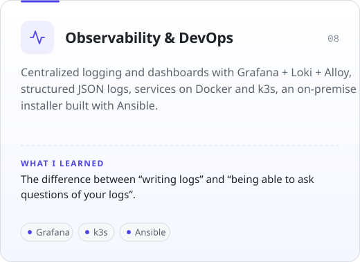</picture>

<picture><source media="(prefers-color-scheme: dark)" srcset="assets/card-09-en-dark.svg">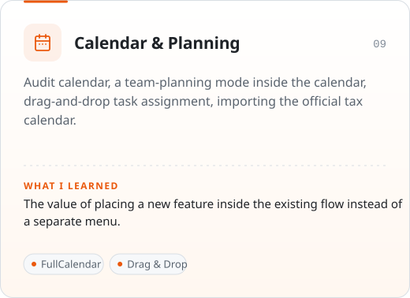</picture>
<picture><source media="(prefers-color-scheme: dark)" srcset="assets/card-10-en-dark.svg">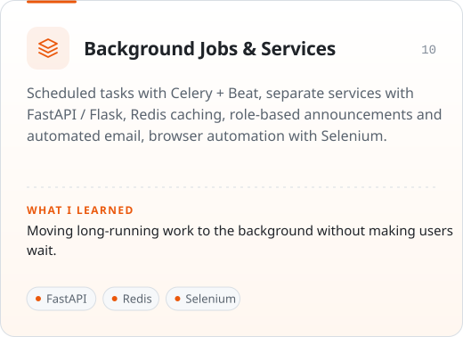</picture>

 

<picture><source media="(prefers-color-scheme: dark)" srcset="assets/section-04-en-dark.svg"></picture>

<picture><source media="(prefers-color-scheme: dark)" srcset="assets/game-en-dark.svg"></picture>

 

<picture><source media="(prefers-color-scheme: dark)" srcset="assets/section-05-en-dark.svg"></picture>

<picture><source media="(prefers-color-scheme: dark)" srcset="https://streak-stats.demolab.com/?user=heysena8-netizen&locale=en&disable_animations=true&hide_border=false&border_radius=16&background=0F141B&border=262D38&stroke=262D38&ring=F97316&fire=F97316&currStreakNum=E6EDF3&currStreakLabel=F97316&sideNums=E6EDF3&sideLabels=8B949E&dates=8B949E"></picture>

 

<picture><source media="(prefers-color-scheme: dark)" srcset="assets/section-06-en-dark.svg"></picture>

<picture><source media="(prefers-color-scheme: dark)" srcset="assets/goals-en-dark.svg">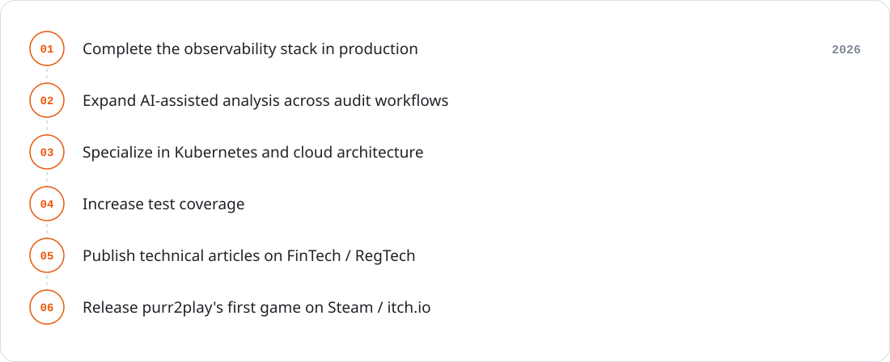</picture>

 

<picture><source media="(prefers-color-scheme: dark)" srcset="assets/section-07-en-dark.svg"></picture>

<picture><source media="(prefers-color-scheme: dark)" srcset="assets/quote-en-dark.svg"></picture>

Happy to talk about financial technology, data-driven applications or user-friendly interfaces — feel free to reach out.

<a href="https://www.linkedin.com/in/sena-y%C3%B6ndemli-45a1653a7/"><picture><source media="(prefers-color-scheme: dark)" srcset="assets/btn-linkedin-en-dark.svg"></picture></a>&nbsp;
<a href="mailto:sena.yondemli@basedata.com.tr"><picture><source media="(prefers-color-scheme: dark)" srcset="assets/btn-mail-en-dark.svg"></picture></a>

 

<picture><source media="(prefers-color-scheme: dark)" srcset="assets/footer-en-dark.svg"></picture>

