<picture><source media="(prefers-color-scheme: dark)" srcset="assets/lang-tr-on-dark.svg"></picture>
<a href="https://github.com/heysena8-netizen/heysena8-netizen/blob/main/README.en.md"><picture><source media="(prefers-color-scheme: dark)" srcset="assets/lang-en-off-dark.svg"></picture></a>

<picture><source media="(prefers-color-scheme: dark)" srcset="assets/header-dark.svg"></picture>

<a href="https://www.linkedin.com/in/sena-y%C3%B6ndemli-45a1653a7/"><picture><source media="(prefers-color-scheme: dark)" srcset="assets/btn-linkedin-dark.svg"></picture></a>&nbsp;
<a href="mailto:sena.yondemli@basedata.com.tr"><picture><source media="(prefers-color-scheme: dark)" srcset="assets/btn-mail-dark.svg"></picture></a>&nbsp;
<picture><source media="(prefers-color-scheme: dark)" srcset="assets/btn-purr2play-dark.svg"></picture>

 

<picture><source media="(prefers-color-scheme: dark)" srcset="assets/section-01-dark.svg"></picture>

<b>Basedata</b>'da, yeminli mali müşavirlerin denetim işlerini dijitalleştiren <b>Portaliva</b> platformunu uçtan uca geliştiriyorum. Karmaşık mevzuatı ve dağınık veriyi <b>tek ekranda anlaşılır</b> hale getirmeyi seviyorum. Yazılımın yanında kendi markam <b>purr2play</b> ile oyun üretiyorum.

<ul>
<li>Beyanname, e-fatura ve e-defterleri <b>denetime hazır veriye</b> dönüştürüyorum</li>
<li>Arayüzün kullanıcıyı yormaması ve bilginin <b>tek bakışta</b> anlaşılması önceliğim</li>
<li>Güvenlik, yetkilendirme ve izlenebilirliğe özellikle önem veriyorum</li>
<li>Veriyi dışarı çıkarmadan çalışan <b>yerel yapay zekâ</b> çözümleri kuruyorum</li>
<li><b>purr2play</b> markasıyla PC için oyunlar geliştiriyorum</li>
<li>Türkçe · İngilizce</li>
</ul>

 

<picture><source media="(prefers-color-scheme: dark)" srcset="assets/section-02-dark.svg"></picture>

<b>DİLLER &amp; FRONTEND</b>  
<picture><source media="(prefers-color-scheme: dark)" srcset="https://skillicons.dev/icons?i=py%2Cjs%2Chtml%2Ccss%2Cbash%2Cpowershell%2Creact%2Cmaterialui%2Cstyledcomponents%2Cnodejs%2Cnpm&perline=12&theme=dark"></picture>

<b>BACKEND &amp; VERİ</b>  
<picture><source media="(prefers-color-scheme: dark)" srcset="https://skillicons.dev/icons?i=django%2Cfastapi%2Cflask%2Cpostgres%2Credis%2Crabbitmq%2Cpytorch%2Copencv%2Cselenium%2Cjest&perline=12&theme=dark"></picture>

<b>DEVOPS &amp; ALTYAPI</b>  
<picture><source media="(prefers-color-scheme: dark)" srcset="https://skillicons.dev/icons?i=docker%2Ckubernetes%2Cansible%2Cnginx%2Cgrafana%2Clinux%2Cgit%2Cvscode&perline=12&theme=dark"></picture>

<picture><source media="(prefers-color-scheme: dark)" srcset="assets/ecosystem-dark.svg"></picture>

 

<picture><source media="(prefers-color-scheme: dark)" srcset="assets/section-03-dark.svg"></picture>

Ayrıntısını görmek istediğiniz başlığa tıklayın

<picture><source media="(prefers-color-scheme: dark)" srcset="assets/row-01-dark.svg"></picture>

<blockquote>

KDV, Kurumlar ve Geçici Vergi beyannamelerini PDF'ten okuyup bölüm bölüm veriye çeviren ayrıştırıcılar.

<b>Öğrendim:</b> Bozuk karakter kodlamaları ve sayfalara bölünen tablolarla başa çıkmak.

<code>pdfplumber</code> <code>PyMuPDF</code> <code>Django</code>

</blockquote>

<picture><source media="(prefers-color-scheme: dark)" srcset="assets/row-02-dark.svg"></picture>

<blockquote>

RabbitMQ kuyruklarından beslenen worker'larla e-defter ve e-fatura XML'lerini işlemek; büyük veride Polars ile hızlı analiz.

<b>Öğrendim:</b> Güvenli XML ayrıştırma ve kuyrukta hata toleransı.

<code>RabbitMQ</code> <code>lxml</code> <code>Polars</code>

</blockquote>

<picture><source media="(prefers-color-scheme: dark)" srcset="assets/row-03-dark.svg"></picture>

<blockquote>

GİB'e yüklenebilir Excel listeleri, Word rapor şablonları ve analiz panoları.

<b>Öğrendim:</b> Resmî dosya biçimlerini ve Türkçe sayı biçimini birebir korumak.

<code>openpyxl</code> <code>docxtpl</code> <code>Highcharts</code>

</blockquote>

<picture><source media="(prefers-color-scheme: dark)" srcset="assets/row-04-dark.svg"></picture>

<blockquote>

Karşıt inceleme, riskli mükellef takibi, mizan ve bilanço denetimi, finansal oranlar.

<b>Öğrendim:</b> İş kurallarını alan uzmanlarıyla birlikte netleştirmek.

<code>Django REST</code> <code>React</code> <code>Ant Design</code>

</blockquote>

<picture><source media="(prefers-color-scheme: dark)" srcset="assets/row-05-dark.svg"></picture>

<blockquote>

E-posta ile tek kullanımlık kod (OTP) girişi, rol ve menü bazlı yetki, şifreli veri, WAF yapılandırması.

<b>Öğrendim:</b> Güvenliği zayıflatmadan WAF yanlış alarmlarını çözmek.

<code>JWT</code> <code>Nginx</code> <code>ModSecurity</code>

</blockquote>

<picture><source media="(prefers-color-scheme: dark)" srcset="assets/row-06-dark.svg"></picture>

<blockquote>

Çok şemalı PostgreSQL, S3 uyumlu depolama, kaldığı yerden devam eden yükleme, kullanıcı bazlı kota.

<b>Öğrendim:</b> Büyük dosyaları sunucuyu yormadan yüklemek.

<code>PostgreSQL</code> <code>MinIO</code> <code>Uppy</code>

</blockquote>

<picture><source media="(prefers-color-scheme: dark)" srcset="assets/row-07-dark.svg"></picture>

<blockquote>

Şirket içinde çalışan AI asistan, mevzuat araması, sesli komut ve belgelerin sesli özeti.

<b>Öğrendim:</b> Hassas veriyi dışarı göndermeden modelleri çalıştırmak.

<code>Ollama</code> <code>faster-whisper</code> <code>Celery</code>

</blockquote>

<picture><source media="(prefers-color-scheme: dark)" srcset="assets/row-08-dark.svg"></picture>

<blockquote>

Grafana + Loki ile merkezi loglama, Docker ve k3s üzerinde servisler, Ansible ile kurulum.

<b>Öğrendim:</b> Log yazmak ile log'dan soru sorabilmek arasındaki fark.

<code>Grafana</code> <code>k3s</code> <code>Ansible</code>

</blockquote>

<picture><source media="(prefers-color-scheme: dark)" srcset="assets/row-09-dark.svg"></picture>

<blockquote>

Denetim takvimi, takvim içinde ekip planlama, sürükle-bırak görev atama.

<b>Öğrendim:</b> Yeni özelliği ayrı menü yerine mevcut akışın içine yerleştirmek.

<code>FullCalendar</code> <code>Drag &amp; Drop</code>

</blockquote>

<picture><source media="(prefers-color-scheme: dark)" srcset="assets/row-10-dark.svg"></picture>

<blockquote>

Celery ile zamanlanmış görevler, FastAPI / Flask servisleri, Redis önbellek, otomatik e-posta.

<b>Öğrendim:</b> Uzun süren işleri kullanıcıyı bekletmeden arka plana almak.

<code>FastAPI</code> <code>Redis</code> <code>Selenium</code>

</blockquote>

 

<picture><source media="(prefers-color-scheme: dark)" srcset="assets/section-04-dark.svg"></picture>

<picture><source media="(prefers-color-scheme: dark)" srcset="assets/game-dark.svg"></picture>

 

<picture><source media="(prefers-color-scheme: dark)" srcset="assets/section-05-dark.svg"></picture>

<picture><source media="(prefers-color-scheme: dark)" srcset="https://streak-stats.demolab.com/?user=heysena8-netizen&locale=tr&disable_animations=true&hide_border=false&border_radius=16&background=0F141B&border=262D38&stroke=262D38&ring=818CF8&fire=F472B6&currStreakNum=E6EDF3&currStreakLabel=818CF8&sideNums=E6EDF3&sideLabels=8B949E&dates=8B949E"></picture>

 

<picture><source media="(prefers-color-scheme: dark)" srcset="assets/section-06-dark.svg"></picture>

<picture><source media="(prefers-color-scheme: dark)" srcset="assets/goals-dark.svg"></picture>

 

<picture><source media="(prefers-color-scheme: dark)" srcset="assets/section-07-dark.svg"></picture>

<picture><source media="(prefers-color-scheme: dark)" srcset="assets/quote-dark.svg"></picture>

Mali teknolojiler, veri odaklı uygulamalar veya kullanıcı dostu arayüzler üzerine konuşmak isterseniz ulaşın.

<a href="https://www.linkedin.com/in/sena-y%C3%B6ndemli-45a1653a7/"><picture><source media="(prefers-color-scheme: dark)" srcset="assets/btn-linkedin-dark.svg"></picture></a>&nbsp;
<a href="mailto:sena.yondemli@basedata.com.tr"><picture><source media="(prefers-color-scheme: dark)" srcset="assets/btn-mail-dark.svg"></picture></a>

 

<picture><source media="(prefers-color-scheme: dark)" srcset="assets/footer-dark.svg"></picture>

